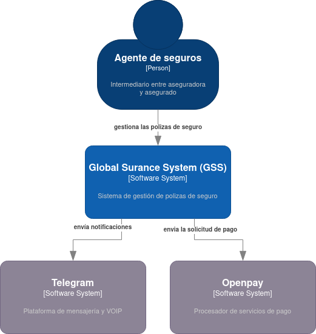

# Descripción General del Proyecto

Este repositorio implementa una arquitectura basada en microservicios para una plataforma de gestión de pólizas de seguro. Cada componente está desacoplado y se comunica mediante un gateway para exponer sus APIs. El sistema se puede ejecutar de forma local usando Docker y `docker-compose`.

## Componentes principales

- **Gestor de clientes**: microservicio en Python (Flask) encargado de almacenar y administrar la información de los clientes.
- **Notificador**: microservicio en Python que envía notificaciones a través de Telegram.
- **Pagos**: microservicio escrito en Go que expone información de los pagos de las pólizas.
- **Reporteador**: microservicio en Python que genera documentos PDF de las pólizas utilizando plantillas.
- **Simulador**: componente que genera pagos de prueba de manera periódica.
- **Cliente**: aplicación Flutter que consume los microservicios y permite interactuar con el sistema.
- **Gateway**: implementación de Tyk que centraliza las rutas de todos los microservicios.

## Ejecución rápida

1. Instala Docker y docker-compose en tu máquina.
2. Clona este repositorio y entra al directorio del proyecto.
3. Ejecuta `docker-compose up -d` para levantar todos los servicios.
4. Accede a la aplicación cliente desde `http://localhost:8000` y prueba las funcionalidades.

## Arquitectura

La siguiente figura describe la vista de contexto general del sistema y se encuentra en `docs/context-view.png`:

Cada microservicio puede desarrollarse y desplegarse de forma independiente. Los servicios se comunican a través de HTTP y el gateway expone las rutas públicas.

Para más información sobre cada componente se pueden consultar los archivos `README.md` de cada carpeta.
